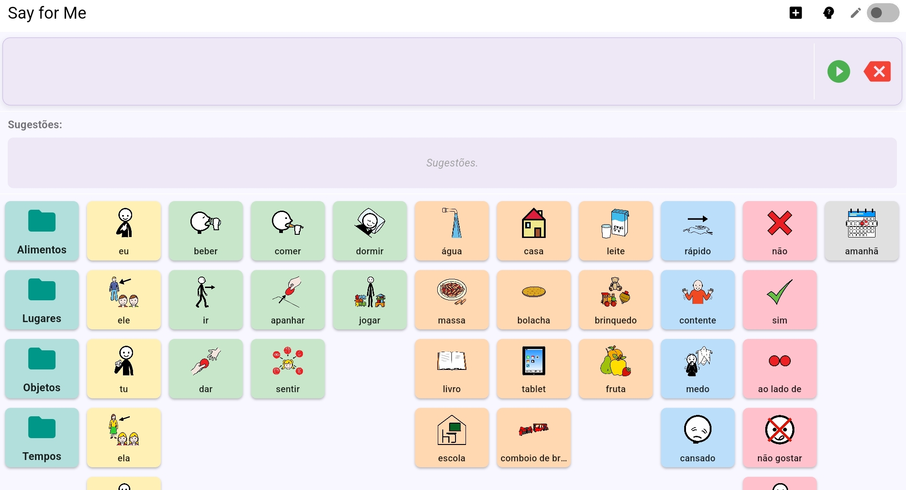

# Say for Me

> **Say for Me** é um aplicativo de Comunicação Aumentativa e Alternativa (CAA) desenvolvido em Flutter, equipado com um sistema inteligente de sugestão de pictogramas baseado em algoritmos de recomendação.

O projeto foi desenvolvido como **Trabalho de Conclusão de Curso (TCC)** para o curso de Engenharia de Computação da **UTFPR – Câmpus Apucarana**.

---

## 🎯 Objetivo

O objetivo do aplicativo é auxiliar usuários com dificuldades de comunicação verbal na construção de frases por meio da seleção de pictogramas. 

Além da funcionalidade tradicional de CAA, o aplicativo incorpora mecanismos de recomendação capazes de sugerir o próximo pictograma com base no contexto da frase em construção, otimizando o tempo de comunicação.

---

## ✨ Funcionalidades

* 💬 **Comunicação por pictogramas:** Interface intuitiva para seleção de símbolos.
* 🗣️ **Síntese de voz (Text-to-Speech):** Reprodução em áudio das frases construídas.
* 📂 **Organização do vocabulário:** Categorização estruturada dos pictogramas.
* 🎨 **Criação de categorias personalizadas:** Flexibilidade para adaptar o aplicativo à rotina do usuário.
* 🌐 **Integração com a API ARASAAC:** Adição de novos pictogramas diretamente da base oficial.
* 📸 **Importação de imagens:** Permite usar fotos personalizadas da galeria do dispositivo.
* 💾 **Armazenamento local:** Persistência de dados offline utilizando SQLite.
* 🧠 **Sistema de sugestões inteligente:** Algoritmos que predizem o próximo passo do usuário.
* 📊 **Métricas automáticas:** Registro de dados de uso para fins de avaliação experimental e acadêmica.

---

## 🧠 Algoritmos de Sugestão

O aplicativo permite alternar dinamicamente entre diferentes modos de recomendação para fins comparativos:

* **Sem Sugestão:** Modo de referência utilizado como linha de base para a comparação experimental.
* **Cadeia de Markov de Ordem 1:** Realiza sugestões considerando apenas o **último** pictograma selecionado.
* **Cadeia de Markov de Ordem 2:** Realiza sugestões considerando os **dois últimos** pictogramas selecionados.
* **K-Nearest Neighbors (KNN):** Realiza sugestões com base na similaridade entre a frase atual e o histórico de frases previamente utilizadas pelo usuário.

---

## 🛠️ Tecnologias Utilizadas

* [Flutter](https://flutter.dev/) & [Dart](https://dart.dev/)
* [SQLite (sqflite)](https://pub.dev/packages/sqflite)
* [SharedPreferences](https://pub.dev/packages/shared_preferences)
* [ARASAAC API](https://arasaac.org/developers/api)
* [Flutter TTS](https://pub.dev/packages/flutter_tts)

---

## 📁 Estrutura do Projeto

```text
lib/
├── models/          # Modelos de dados (Pictograma, Categoria, Frase, etc.)
├── repositories/    # Camada de abstração e manipulação de dados
├── screens/         # Telas principais da aplicação
├── services/        # Lógica de negócio (Algoritmos de recomendação, TTS, API)
├── utils/           # Funções utilitárias e constantes
├── widgets/         # Componentes customizados da interface
└── main.dart        # Ponto de entrada do aplicativo
```
---

### 🧩 Principais Componentes

| Componente | Responsabilidade |
| :--- | :--- |
| `MainScreen` | Tela principal e centralizadora da aplicação. |
| `PictogramRepository` | Camada de acesso, cache e manipulação dos dados dos pictogramas. |
| `DatabaseService` | Inicialização, migração e persistência local com SQLite. |
| `SuggestionService` | Concentra a lógica e os algoritmos de recomendação. |
| `SentenceBar` | Widget responsável por exibir e gerenciar a frase em construção. |
| `SuggestionBar` | Barra horizontal que exibe os pictogramas sugeridos pelo algoritmo ativo. |
| `BoardGrid` | Grade que organiza e renderiza os pictogramas disponíveis na categoria. |

---

## 🗄️ Banco de Dados

Os dados dos pictogramas são mantidos localmente para garantir o funcionamento offline do aplicativo. As principais informações persistidas são:

* 🔑 **Identificador do pictograma**
* 📝 **Palavra-chave**
* 🏷️ **Tags associadas**
* 📐 **Tipo gramatical** (Substantivo, Verbo, Adjetivo, etc.)
* 📈 **Quantidade de utilização** (Frequência)

---

## 📊 Avaliação Experimental (Métricas)

Para validar a eficiência dos algoritmos, o aplicativo conta com um módulo de coleta automatizada de métricas. Os dados registrados incluem:

* 🔘 Número de cliques
* 📜 Quantidade de *scrolls* realizados
* 📂 Quantidade de categorias abertas
* 🎯 Quantidade de acertos na primeira sugestão exibida
* ✍️ Frase final construída
* 🤖 Modo de recomendação que estava ativo

> 📋 **Nota:** Todos os dados coletados são exportados localmente em formato **CSV** para posterior análise estatística e tratamento acadêmico.

---

## 📱 Capturas de Tela

| Tela Principal / Prancha | Sistema de Sugestões |
| :---: | :---: |
|  |  |

---

## 🚀 Como Executar

### Pré-requisitos
* **Flutter SDK** configurado na máquina.
* **Ferramentas de compilação do Android** (como as do Android SDK Command-line Tools).
* Um dispositivo Android físico conectado via USB com depuração ativada ou um Emulador Android ativo.

### Passo a Passo

1. Clone o repositório:
```bash
git clone [https://github.com/AngelicaBGLuciano/Say_for_me.git](https://github.com/AngelicaBGLuciano/Say_for_me.git)
```
2. Acesse a pasta do projeto:
```bash
cd Say_for_me
```
3. Baixe as dependências do projeto:
```bash
flutter pub get
```
4. Execute o aplicativo no dispositivo conectado:
```bash
flutter run -d id_dispositivo
```
---
<!--
## 📦 Download do APK

Se você deseja testar o aplicativo diretamente em um dispositivo Android sem precisar compilar o código fonte, o arquivo executável está disponível para download:

* 📥 **[Baixar o APK do Say for Me (Última Versão)](https://github.com/AngelicaBGLuciano/Say_for_me/releases)**

---
-->
## 📄 Licença
Este projeto foi desenvolvido estritamente para fins acadêmicos e de pesquisa como Trabalho de Conclusão de Curso (TCC).

---

## 👩‍💻 Autoria
  * Angélica Luciano – Engenharia de Computação – UTFPR Apucarana
  * GitHub: @AngelicaBGLuciano
